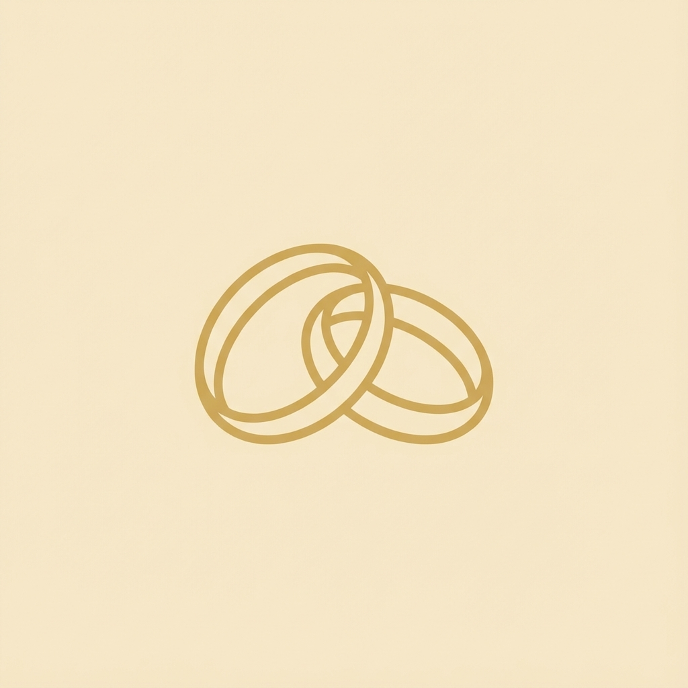

# Forever | Digital Wedding Gallery

**Forever** is a timeless digital sanctuary designed to preserve and showcase the most cherished moments of our special day. Built with elegance and simplicity in mind, it serves as a permanent archive of our love story through imagery.



## ✨ Features

- **Timeless Design**: A clean, distraction-free interface built with an ivory and champagne gold color palette, using the elegant *Playfair Display* serif typography.
- **Infinite Browsing**: Automatic infinite scroll functionality providing a seamless, immersive viewing experience.
- **Smart Masonry Layout**: A responsive, self-organizing grid that adapts to any screen size, ensuring every photograph is presented perfectly without gaps or shifts.
- **Immersive Lightbox**: Click any photo to view it in full splendor, free from distractions.
- **Performance Optimized**: Fast loading times with optimized image delivery.

## 🛠️ Technology Stack

- **Framework**: [React](https://react.dev/) with [Vite](https://vitejs.dev/)
- **Styling**: [Tailwind CSS](https://tailwindcss.com/) & Vanilla CSS
- **Animations**: [Framer Motion](https://www.framer.com/motion/)
- **Icons**: [Lucide React](https://lucide.dev/)
- **Cloud Infrastructure**: Cloudinary (Mock/Simulated integration ready for real deployment)

## 🚀 Getting Started

### Prerequisites

- Node.js (Version 16 or higher)

### Installation

1.  **Clone the repository:**
    ```bash
    git clone https://github.com/your-username/forever-gallery.git
    cd forever-gallery
    ```

2.  **Install dependencies:**
    ```bash
    npm install
    ```

3.  **Run the development server:**
    ```bash
    npm run dev
    ```

## 📸 Managing Photos

To add new photos to the gallery:

1.  Place your images in a local directory (e.g., `E:\WeddingPhotos`).
2.  Run the upload script:
    ```bash
    node scripts/upload-images.js "E:\WeddingPhotos"
    ```
3.  The script will automatically process and upload the images to the gallery.

---

*"Start your forever, one memory at a time."*
